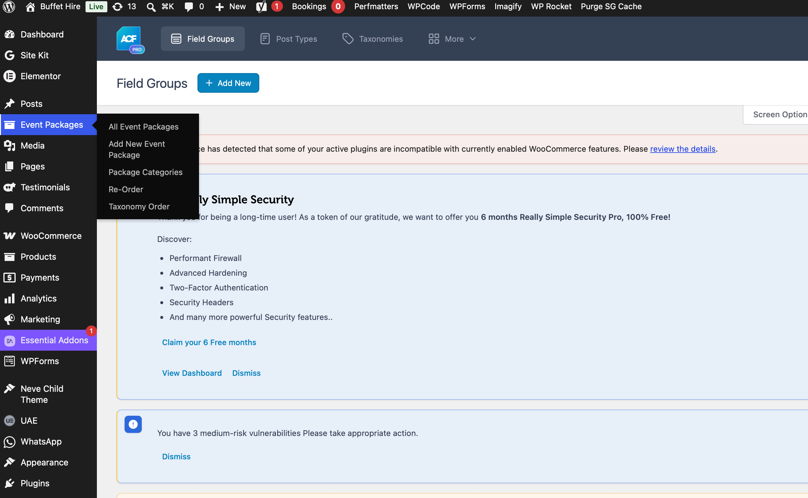
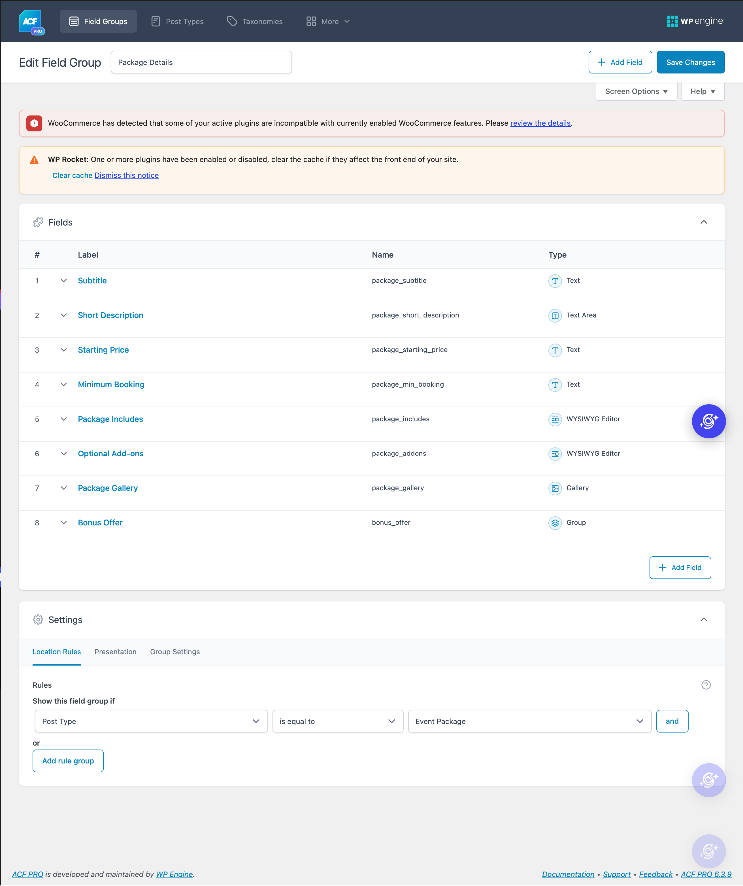
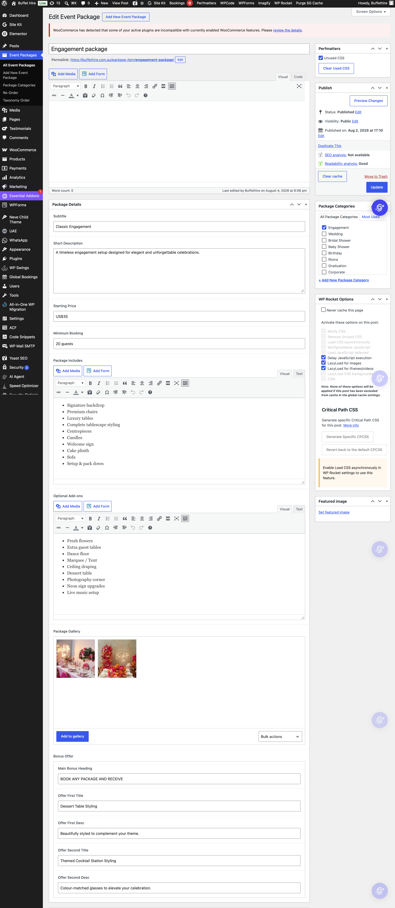
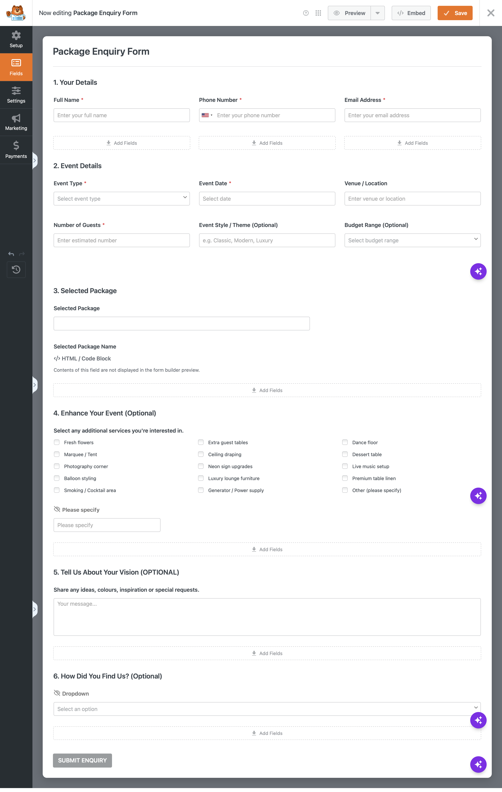
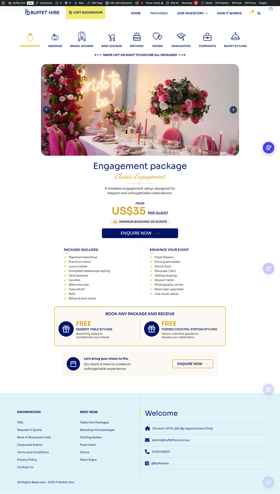
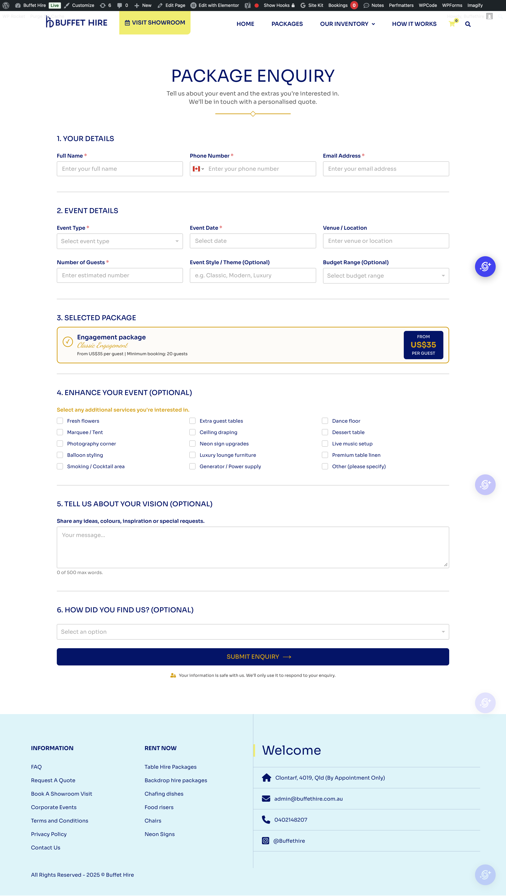

# Custom Event Package & Dynamic Enquiry Engine for WordPress

[](https://buffethire.com.au/package/)

> 🔗 **Live Production Site**: [https://buffethire.com.au/package/](https://buffethire.com.au/package/)

A custom WordPress architecture designed to replace standard e-commerce booking flows with an interactive event package directory and dynamic WPForms lead-generation engine.

---

## 📌 Technical Overview

* **Custom Schema**: Registers Custom Post Type (`custom_package`) paired with custom category taxonomies (`event_package_cat`) and ACF Pro field structures.
* **Interactive UI**: Category tab filtering and responsive gallery sliders built with Slick.js and custom CSS.
* **Query Parameter Handoff**: Passes selected package data (`pkg_title`, `pkg_sub`, `pkg_price`, `pkg_min`) dynamically via URL query parameters on CTA click.
* **Dynamic Form Auto-Fill**: Parses incoming URL parameters with custom JavaScript to populate hidden WPForms inputs (Form ID #8231) and build a live UI "Selected Package" preview card.
* **WooCommerce Suppressions**: Hides default e-commerce pricing and booking date pickers using targeted PHP action hooks and CSS overrides.

---

## 🛠️ Data Architecture (ACF Schema)

| Field Label | Field Name | Type | Purpose |
| :--- | :--- | :--- | :--- |
| Subtitle | `package_subtitle` | Text | Secondary styling theme (e.g., *Classic Engagement*) |
| Short Description | `package_short_description` | Text Area | High-level summary text |
| Starting Price | `package_starting_price` | Text | Per-guest base starting rate |
| Minimum Booking | `package_min_booking` | Text | Guest capacity requirements |
| Package Includes | `package_includes` | WYSIWYG | Itemized list of inclusions |
| Optional Add-ons | `package_addons` | WYSIWYG | Enhancement feature list |
| Package Gallery | `package_gallery` | Gallery | Multi-image array rendered in Slick carousel |
| Bonus Offer | `bonus_offer` | Group | Sub-fields for promotional perks |

---

## 📸 Project Screenshots

### 1. Custom Post Type & Admin Navigation


### 2. ACF Pro Field Setup


### 3. Admin Package Editor


### 4. WPForms Integration Setup


### 5. Interactive Frontend Packages Directory


### 6. Dynamic Package Enquiry Form


---

## 📁 Repository Directory Structure

```text
wp-event-package-enquiry-engine/
├── docs/
│   └── screenshots/
│       ├── ACF-details.png
│       ├── Custom-post-type.png
│       ├── Event-package.png
│       ├── Event-package-enquiry.png
│       ├── Package-Edit-page.png
│       └── WP-Form-setup.png
├── src/
│   ├── assets/
│   │   ├── css/
│   │   └── js/
│   └── package-engine.php
└── README.md

```
---

## 🔄 Navigation & User Workflow Architecture

```text
[ Main Navigation Menu ("Packages") ] 
               │
               ├─────────────────────────────────────────┐
               ▼                                         ▼
[ WooCommerce Single Product Page ]             [ Event Packages Directory Hub ]
       │                                                 │
       └─► (Suppressed E-Commerce Booking/Pricing)       ├─► Interactive Category Tabs
       └─► Click "VIEW PACKAGES" CTA Button ────────────► ├─► Slick.js Media Gallery
                                                         └─► Click "ENQUIRE NOW" Button
                                                                       │
                                                                       ▼
                                                       [ Query Parameter Handoff ]
                                                                       │
                                                                       ▼
                                                       [ Dynamic Package Enquiry Form ]
                                                         * JS parses URL parameters
                                                         * Fills hidden input fields (#8231)
                                                         * Generates live UI preview card
```
